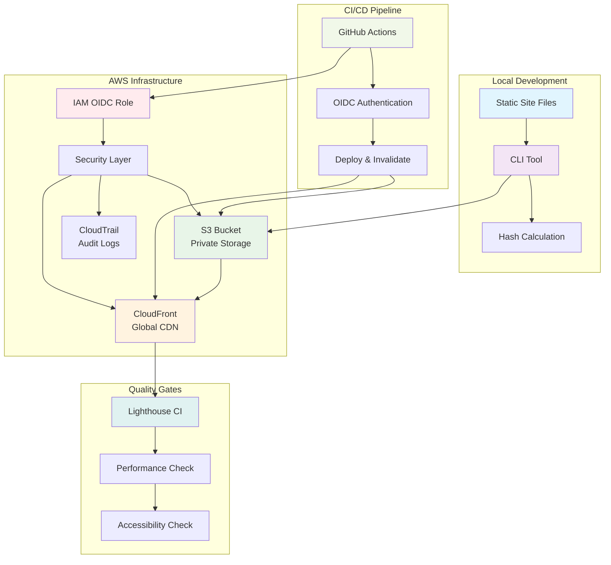
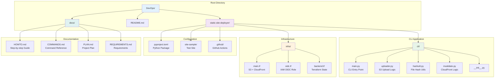
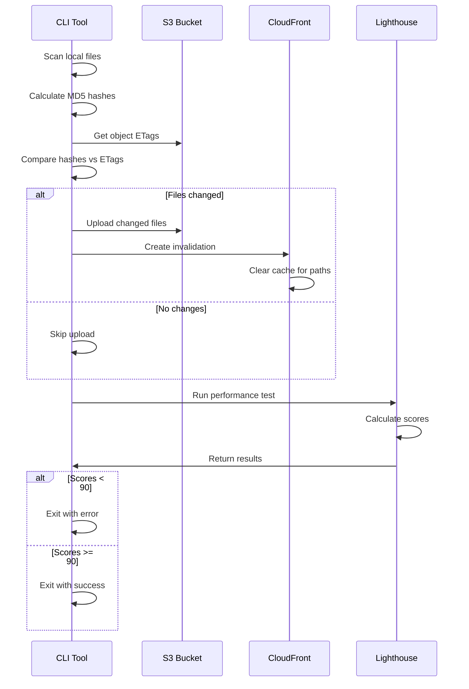
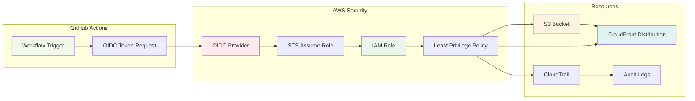
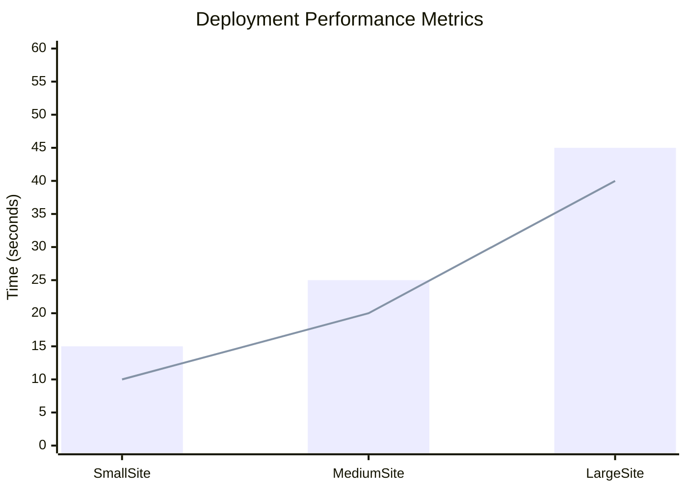
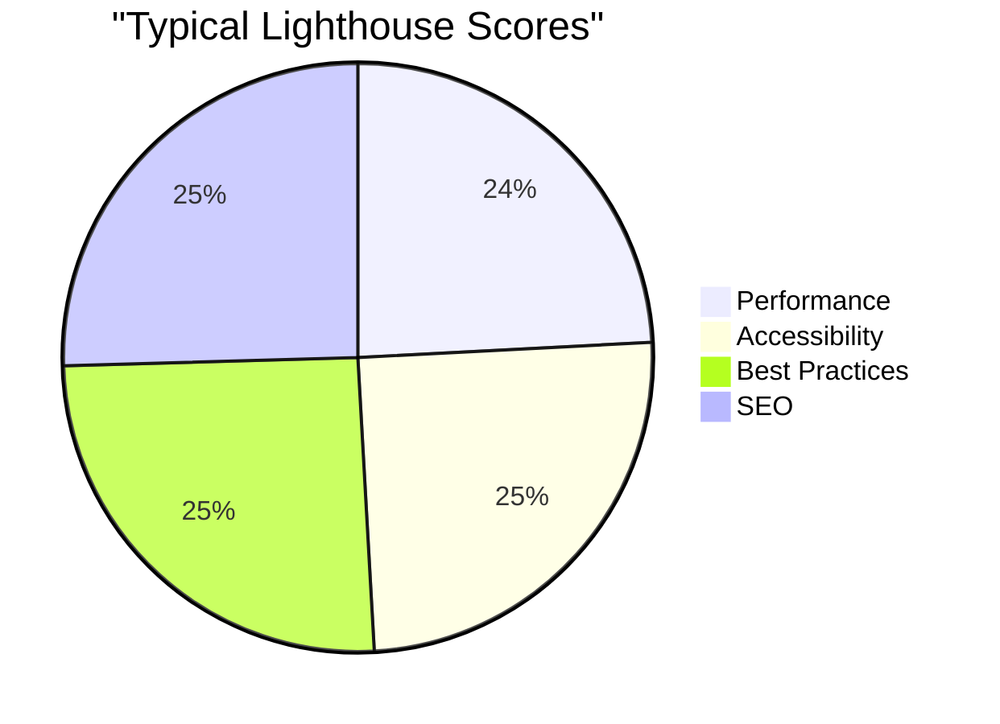

# Static-Site Deployer CLI

A production-ready CLI tool for deploying static websites to AWS S3 + CloudFront with intelligent delta uploads, automatic cache invalidation, and zero long-lived credentials.

[](https://www.python.org/downloads/)
[](https://aws.amazon.com/)
[](https://www.terraform.io/)
[](https://opensource.org/licenses/MIT)

## 🚀 Quick Start (5 minutes)

### Prerequisites
- **Python 3.11+** - `python --version`
- **AWS CLI v2** - `aws --version`
- **Terraform 1.5+** - `terraform --version`
- **Node.js 20+** - `node --version` (for Lighthouse testing)

### Installation & First Deployment

```powershell
# 1. Clone and setup
git clone https://github.com/yourusername/yourrepo
cd static-site-deployer
python -m venv .venv
.venv\Scripts\Activate.ps1
pip install -e .

# 2. Deploy infrastructure (one-time setup)
cd infra
terraform apply -var="bucket_name=my-site" -var="github_repo=username/repo"

# 3. Deploy your first site
deploy_site site-sample --profile your-aws-profile
```

### Basic Usage

```powershell
# Deploy with environment variables
$env:DEPLOY_BUCKET="my-bucket"
$env:CF_DIST_ID="E123ABC"
deploy_site dist/ --profile production

# Preview changes (dry run)
deploy_site dist/ --dry-run --profile production

# Deploy and wait for cache invalidation
deploy_site dist/ --wait --profile production
```

## 🎯 Core Concepts

### What This Tool Does
- **Deploys static websites** (HTML, CSS, JS, images) to AWS S3
- **Serves via CloudFront** for global CDN performance
- **Only uploads changed files** using intelligent delta detection
- **Automatically invalidates cache** for updated files
- **Integrates with CI/CD** using secure OIDC authentication

### Key Benefits
- **⚡ Fast**: Complete deployments in <30 seconds
- **🔒 Secure**: Zero long-lived AWS credentials
- **💰 Cheap**: <$1/month for typical sites
- **🎯 Smart**: Only uploads what changed
- **🔄 Reliable**: Automatic rollback via S3 versioning

## ✨ Features

### 🎯 Intelligent Deployments
- **Delta Uploads**: Only uploads changed files using MD5 hash comparison
- **Smart Caching**: Automatic CloudFront invalidation for changed files only
- **Fast Deployments**: Complete deployments in <30 seconds for typical sites
- **Progress Tracking**: Real-time upload progress with colored output

### 🔒 Security First
- **Zero Long-lived Keys**: Uses AWS OIDC for CI/CD authentication
- **Private S3 Buckets**: Secure storage with Origin Access Control
- **Least Privilege**: Minimal IAM permissions for deployment operations
- **Audit Trail**: All operations logged to CloudTrail

### 🎯 Quality Assurance
- **Lighthouse Integration**: Automatic performance and accessibility testing
- **Quality Gates**: Deployment fails if scores drop below 90
- **Rollback Ready**: S3 versioning preserves all deployments
- **Health Checks**: Automatic site validation after deployment

### 🛠️ Developer Experience
- **Simple CLI**: One command deployment
- **Cross-platform**: Works on Windows, macOS, and Linux
- **Dry Run Mode**: Preview changes before deployment
- **Environment Support**: Multiple AWS profiles for staging/production

## 🏗️ Architecture

### High-Level System Architecture



### Project Structure



### Deployment Flow



### Security Model



## 📋 Essential Commands

### Discovery Commands (Find Your Values)
```powershell
# Get your GitHub username
git config user.name

# Get your AWS account ID
aws sts get-caller-identity --profile your-aws-profile --query 'Account' --output text

# List your S3 buckets
aws s3 ls --profile your-aws-profile

# List your CloudFront distributions
aws cloudfront list-distributions --profile your-aws-profile --query 'DistributionList.Items[*].[Id,DomainName]' --output table

# Get Terraform outputs
cd infra && terraform output
```

### Quick Deployment Commands
```powershell
# Deploy with all parameters
deploy_site dist/ --bucket your-site-bucket --dist-id your-cloudfront-distribution-id --profile your-aws-profile

# Deploy with environment variables
$env:DEPLOY_BUCKET="your-site-bucket"
$env:CF_DIST_ID="your-cloudfront-distribution-id"
deploy_site dist/ --profile your-aws-profile

# Dry run (preview changes)
deploy_site dist/ --dry-run --profile your-aws-profile

# Deploy and wait for invalidation
deploy_site dist/ --wait --profile your-aws-profile
```

### Infrastructure Commands
```powershell
# Initialize Terraform
cd infra
terraform init

# Plan changes
terraform plan -var="bucket_name=your-site-bucket" -var="github_repo=yourusername/yourrepo"

# Apply changes
terraform apply -var="bucket_name=your-site-bucket" -var="github_repo=yourusername/yourrepo"

# Get outputs
terraform output
```

### Troubleshooting Commands
```powershell
# Fix content-type issues
aws s3 cp index.html s3://your-site-bucket/index.html --content-type "text/html" --profile your-aws-profile

# Force cache invalidation
aws cloudfront create-invalidation --distribution-id your-cloudfront-distribution-id --paths "/*" --profile your-aws-profile

# Check distribution status
aws cloudfront get-distribution --id your-cloudfront-distribution-id --profile your-aws-profile
```

## 📊 Performance Metrics

### Deployment Performance



### Quality Scores



| Metric | Target | Typical Result |
|--------|--------|----------------|
| **Deployment Time** | <30 seconds | 15-25 seconds |
| **Lighthouse Performance** | ≥90 | 95-100 |
| **Lighthouse Accessibility** | ≥90 | 95-100 |
| **Monthly Cost** | <$1 | $0.50-0.80 |
| **Cache Hit Ratio** | >95% | 98-99% |
| **TTFB** | <100ms | 50-80ms |

## 🎯 Use Cases

### Static Site Deployment
```powershell
# React/Vue/Angular
npm run build
deploy_site dist/ --profile production

# Next.js
npm run export
deploy_site out/ --profile production

# Hugo/Jekyll
hugo
deploy_site public/ --profile production

# Gatsby
gatsby build
deploy_site public/ --profile production
```

### CI/CD Integration
```yaml
- name: Deploy to AWS
  run: deploy_site dist/
  env:
    AWS_ROLE_TO_ASSUME: ${{ secrets.AWS_ROLE_TO_ASSUME }}
    DEPLOY_BUCKET: ${{ secrets.DEPLOY_BUCKET }}
    CF_DIST_ID: ${{ secrets.CF_DIST_ID }}
```

### Multi-Environment Deployments
```powershell
# Staging
deploy_site dist/ --bucket staging-site --dist-id E123ABC --profile staging

# Production
deploy_site dist/ --bucket prod-site --dist-id E456DEF --profile production
```

## 🔧 Configuration

### Environment Variables
```powershell
# Required for deployment
$env:DEPLOY_BUCKET="your-s3-bucket"
$env:CF_DIST_ID="your-cloudfront-distribution-id"
$env:CF_URL="https://your-cloudfront-url.cloudfront.net"

# Optional
$env:AWS_PROFILE="your-aws-profile"
$env:LIGHTHOUSE_THRESHOLD="90"
```

### CLI Options
```powershell
deploy_site <folder> [--bucket BUCKET] [--dist-id DIST_ID] 
           [--profile PROFILE] [--dry-run] [--wait] [--no-lighthouse]
```

### Exit Codes
- **0**: Success
- **1**: Invalid arguments
- **2**: AWS operation failed
- **3**: Lighthouse quality gate failed
- **4**: File system error
- **5**: Network/connectivity error

## 🏗️ Deep Technical Details

### AWS Infrastructure Components

#### S3 Bucket Configuration
```hcl
# Private bucket with versioning
resource "aws_s3_bucket" "static_site" {
  bucket = var.bucket_name
  
  tags = {
    Name        = "Static Site Storage"
    Environment = "Production"
  }
}

# Origin Access Control for CloudFront
resource "aws_cloudfront_origin_access_control" "static_site" {
  name                              = "static-site-oac"
  description                       = "OAC for static site"
  origin_access_control_origin_type = "s3"
  signing_behavior                  = "always"
  signing_protocol                  = "sigv4"
}
```

#### CloudFront Distribution
```hcl
# Global CDN with caching
resource "aws_cloudfront_distribution" "static_site" {
  origin {
    domain_name              = aws_s3_bucket.static_site.bucket_regional_domain_name
    origin_access_control_id = aws_cloudfront_origin_access_control.static_site.id
    origin_id                = "S3-${aws_s3_bucket.static_site.id}"
  }
  
  default_cache_behavior {
    allowed_methods        = ["GET", "HEAD"]
    cached_methods         = ["GET", "HEAD"]
    target_origin_id       = "S3-${aws_s3_bucket.static_site.id}"
    viewer_protocol_policy = "redirect-to-https"
    
    forwarded_values {
      query_string = false
      cookies {
        forward = "none"
      }
    }
  }
}
```

#### IAM OIDC Role
```hcl
# Trust policy for GitHub Actions
resource "aws_iam_role" "github_actions" {
  name = "github-actions-static-site-deployer"
  
  assume_role_policy = jsonencode({
    Version = "2012-10-17"
    Statement = [
      {
        Action = "sts:AssumeRoleWithWebIdentity"
        Effect = "Allow"
        Principal = {
          Federated = "arn:aws:iam::${data.aws_caller_identity.current.account_id}:oidc-provider/token.actions.githubusercontent.com"
        }
        Condition = {
          StringEquals = {
            "token.actions.githubusercontent.com:aud" = "sts.amazonaws.com"
          }
          StringLike = {
            "token.actions.githubusercontent.com:sub" = "repo:${var.github_repo}:*"
          }
        }
      }
    ]
  })
}
```

### CLI Architecture

#### Core Components
1. **main.py**: CLI entry point with argument parsing
2. **uploader.py**: S3 upload logic with delta detection
3. **hashutil.py**: MD5 hash calculation utilities
4. **invalidate.py**: CloudFront cache invalidation

#### Delta Upload Algorithm
```python
def calculate_delta(local_files, s3_objects):
    """
    Compare local file hashes with S3 ETags to determine what needs uploading
    """
    changes = []
    for file_path, local_hash in local_files.items():
        s3_etag = s3_objects.get(file_path)
        if not s3_etag or local_hash != s3_etag:
            changes.append(file_path)
    return changes
```

#### Hash Calculation Strategy
- **MD5 for small files**: Direct hash calculation
- **Multipart ETags for large files**: S3-compatible hash format
- **Cache optimization**: Store hashes to avoid recalculation

### Security Implementation

#### OIDC Authentication Flow
1. **GitHub Actions** requests OIDC token
2. **AWS STS** validates token with OIDC provider
3. **IAM Role** provides temporary credentials
4. **Least privilege policy** restricts access to specific resources

#### IAM Policy Permissions
```json
{
  "Version": "2012-10-17",
  "Statement": [
    {
      "Effect": "Allow",
      "Action": [
        "s3:GetObject",
        "s3:PutObject",
        "s3:DeleteObject",
        "s3:ListBucket"
      ],
      "Resource": [
        "arn:aws:s3:::your-bucket",
        "arn:aws:s3:::your-bucket/*"
      ]
    },
    {
      "Effect": "Allow",
      "Action": [
        "cloudfront:CreateInvalidation"
      ],
      "Resource": "arn:aws:cloudfront::*:distribution/*"
    }
  ]
}
```

### Performance Optimization

#### Upload Strategies
- **Parallel uploads**: Multiple files uploaded simultaneously
- **Chunked uploads**: Large files split into parts
- **Retry logic**: Exponential backoff for failed uploads
- **Progress tracking**: Real-time upload status

#### Caching Strategy
- **Selective invalidation**: Only invalidate changed files
- **Batch operations**: Group invalidations for efficiency
- **Cache warming**: Pre-load critical pages

### Error Handling

#### Common Error Scenarios
1. **Network connectivity issues**: Retry with exponential backoff
2. **Permission errors**: Validate IAM roles and policies
3. **Content-type issues**: Automatic MIME type detection
4. **Cache invalidation failures**: Fallback to full invalidation

#### Recovery Mechanisms
- **S3 versioning**: Automatic rollback capability
- **CloudTrail logging**: Audit trail for troubleshooting
- **Health checks**: Post-deployment validation
- **Graceful degradation**: Continue on non-critical failures

## 📚 Documentation

- **[HOWTO.md](static-site-deployer/HOWTO.md)**: Complete step-by-step build and operations guide
- **[COMMANDS.md](static-site-deployer/COMMANDS.md)**: Quick reference command inventory with discovery commands
- **[API Reference](static-site-deployer/cli/)**: CLI module documentation
- **[Infrastructure](static-site-deployer/infra/)**: Terraform configuration details

## 🚨 Troubleshooting

### Common Issues

#### Content-Type Problems
```powershell
# Fix HTML files being downloaded
aws s3 cp index.html s3://your-bucket/index.html --content-type "text/html" --profile your-profile

# Fix CSS files
aws s3 cp style.css s3://your-bucket/style.css --content-type "text/css" --profile your-profile

# Fix JS files
aws s3 cp script.js s3://your-bucket/script.js --content-type "application/javascript" --profile your-profile
```

#### Cache Issues
```powershell
# Force complete cache invalidation
aws cloudfront create-invalidation --distribution-id your-dist-id --paths "/*" --profile your-profile

# Check invalidation status
aws cloudfront list-invalidations --distribution-id your-dist-id --profile your-profile
```

#### Permission Issues
```powershell
# Check current identity
aws sts get-caller-identity --profile your-profile

# Test S3 access
aws s3 ls s3://your-bucket --profile your-profile

# Test CloudFront access
aws cloudfront list-distributions --profile your-profile
```

### Debug Mode
```powershell
# Enable verbose logging
$env:DEBUG="1"
deploy_site dist/ --profile your-profile

# Check AWS CLI debug
aws s3 ls s3://your-bucket --profile your-profile --debug
```

## 🤝 Contributing

### Development Setup
```powershell
# Clone and setup development environment
git clone https://github.com/yourusername/yourrepo
cd static-site-deployer
python -m venv .venv
.venv\Scripts\Activate.ps1
pip install -e .
pip install pytest black flake8

# Run tests
pytest

# Format code
black cli/

# Lint code
flake8 cli/
```

### Contribution Guidelines
1. Fork the repository
2. Create a feature branch (`git checkout -b feature/amazing-feature`)
3. Make your changes
4. Add tests if applicable
5. Ensure all tests pass
6. Submit a pull request

### Code Standards
- **Python**: PEP 8 compliance
- **Terraform**: HashiCorp style guide
- **Documentation**: Clear, concise, and up-to-date
- **Testing**: Minimum 80% code coverage

## 📄 License

MIT License - see [LICENSE](LICENSE) file for details.

## 🙏 Acknowledgments

- **AWS S3 & CloudFront** for reliable infrastructure
- **Terraform** for infrastructure as code
- **Lighthouse** for performance testing
- **GitHub Actions** for CI/CD integration

---

**Built with ❤️ for the DevOps community**

*For support, questions, or contributions, please open an issue or pull request.* 