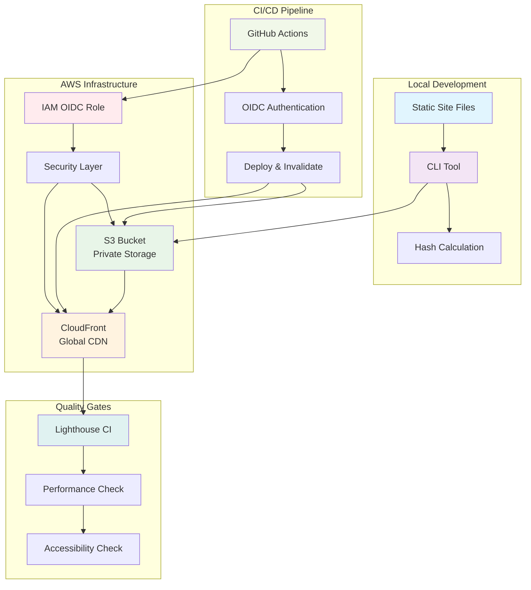
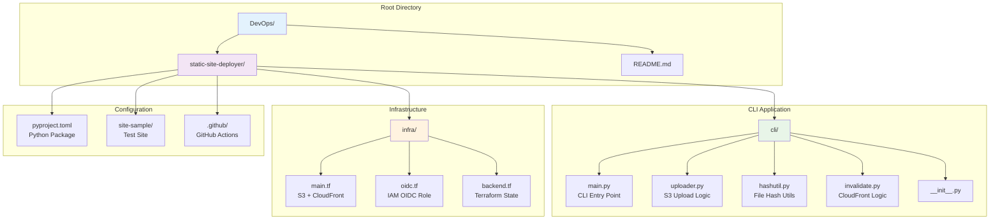
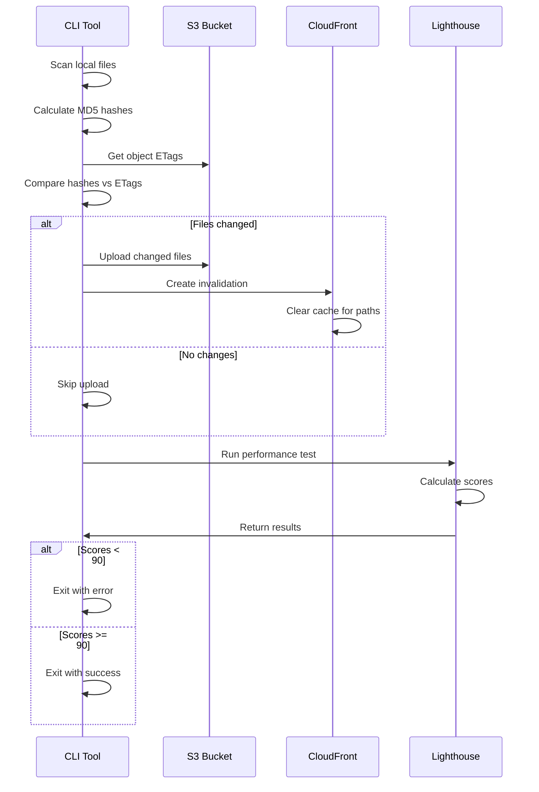
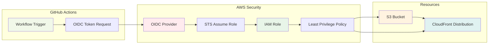
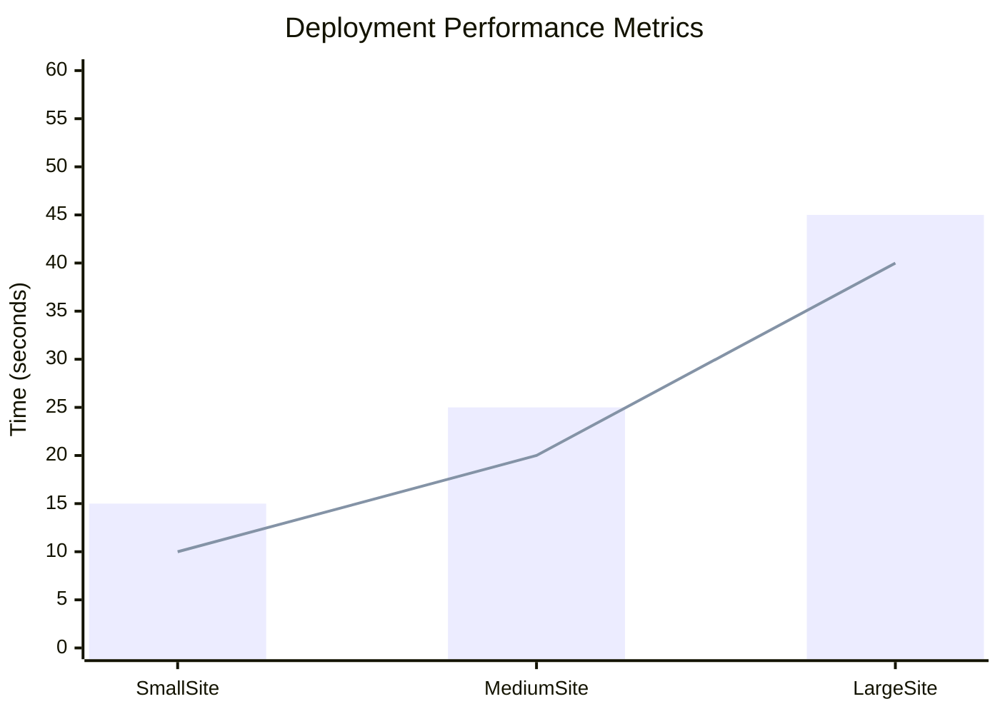
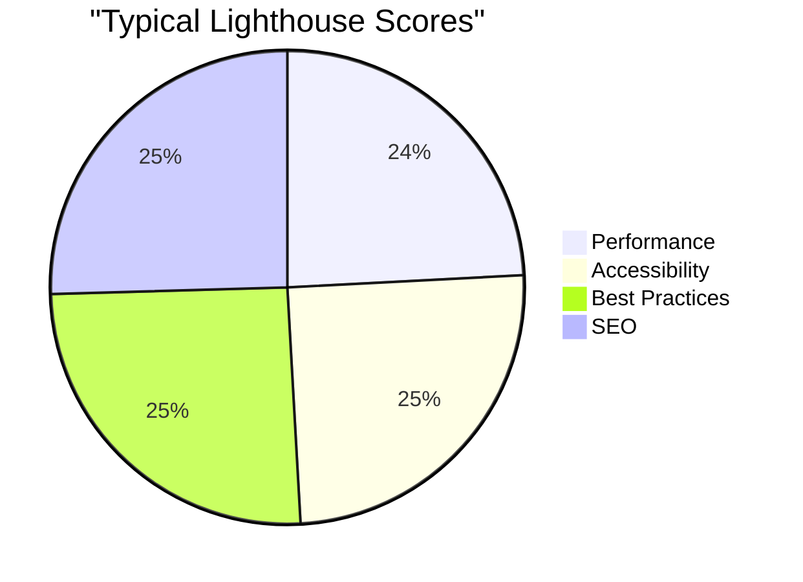

# Static-Site Deployer CLI

A production-ready CLI tool for deploying static websites to AWS S3 + CloudFront with intelligent delta uploads, automatic cache invalidation, and zero long-lived credentials.


## 🚀 Quick Start

### Prerequisites
- Python 3.11+
- AWS CLI v2
- Terraform 1.5+
- Node.js 20+ (for Lighthouse)

### Installation & Setup

```powershell
# 1. Clone and setup environment
git clone https://github.com/yourusername/yourrepo
cd static-site-deployer
python -m venv .venv
.venv\Scripts\Activate.ps1
pip install -e .

# 2. Deploy infrastructure
cd infra
terraform apply -var="bucket_name=my-site" -var="github_repo=username/repo"

# 3. Deploy your first site
deploy_site site-sample --profile your-aws-profile
```

### Basic Usage

```powershell
# Deploy with environment variables
$env:DEPLOY_BUCKET="my-bucket"
$env:CF_DIST_ID="E123ABC"
deploy_site dist/ --profile production

# Preview changes (dry run)
deploy_site dist/ --dry-run --profile production

# Deploy and wait for cache invalidation
deploy_site dist/ --wait --profile production
```

## ✨ Key Features

### 🎯 Intelligent Deployments
- **Delta Uploads**: Only uploads changed files using MD5 hash comparison
- **Smart Caching**: Automatic CloudFront invalidation for changed files only
- **Fast Deployments**: Complete deployments in <30 seconds for typical sites

### 🔒 Security First
- **Zero Long-lived Keys**: Uses AWS OIDC for CI/CD authentication
- **Private S3 Buckets**: Secure storage with Origin Access Control
- **Least Privilege**: Minimal IAM permissions for deployment operations

### 🎯 Quality Assurance
- **Lighthouse Integration**: Automatic performance and accessibility testing
- **Quality Gates**: Deployment fails if scores drop below 90
- **Rollback Ready**: S3 versioning preserves all deployments

### 🛠️ Developer Experience
- **Simple CLI**: One command deployment
- **Cross-platform**: Works on Windows, macOS, and Linux
- **Progress Tracking**: Real-time upload progress with colored output

## 🏗️ System Architecture

### High-Level Architecture



### Project Structure



### Deployment Flow



### Security Model



## 📊 Performance Metrics

### Deployment Performance



### Quality Scores



| Metric | Target | Typical Result |
|--------|--------|----------------|
| **Deployment Time** | <30 seconds | 15-25 seconds |
| **Lighthouse Performance** | ≥90 | 95-100 |
| **Lighthouse Accessibility** | ≥90 | 95-100 |
| **Monthly Cost** | <$1 | $0.50-0.80 |

## 🎯 Use Cases

### Static Site Deployment
```powershell
# React/Vue/Angular
npm run build
deploy_site dist/ --profile production

# Next.js
npm run export
deploy_site out/ --profile production

# Hugo/Jekyll
hugo
deploy_site public/ --profile production
```

### CI/CD Integration
```yaml
- name: Deploy to AWS
  run: deploy_site dist/
  env:
    AWS_ROLE_TO_ASSUME: ${{ secrets.AWS_ROLE_TO_ASSUME }}
```

### Multi-Environment Deployments
```powershell
# Staging
deploy_site dist/ --bucket staging-site --dist-id E123ABC --profile staging

# Production
deploy_site dist/ --bucket prod-site --dist-id E456DEF --profile production
```

## 🔧 Configuration

### Environment Variables
```powershell
$env:DEPLOY_BUCKET="your-s3-bucket"
$env:CF_DIST_ID="your-cloudfront-distribution-id"
$env:CF_URL="https://your-cloudfront-url.cloudfront.net"
```

### CLI Options
```powershell
deploy_site <folder> [--bucket BUCKET] [--dist-id DIST_ID] 
           [--profile PROFILE] [--dry-run] [--wait]
```

### Exit Codes
- **0**: Success
- **1**: Invalid arguments
- **2**: AWS operation failed
- **3**: Lighthouse quality gate failed

## 📚 Documentation

- **[HOWTO.md](static-site-deployer/HOWTO.md)**: Complete step-by-step build and operations guide
- **[COMMANDS.md](static-site-deployer/COMMANDS.md)**: Quick reference command inventory
- **[API Reference](static-site-deployer/cli/)**: CLI module documentation
- **[Infrastructure](static-site-deployer/infra/)**: Terraform configuration

## 🤝 Contributing

1. Fork the repository
2. Create a feature branch
3. Make your changes
4. Add tests if applicable
5. Submit a pull request

## 📄 License

MIT License - see [LICENSE](LICENSE) file for details.

---

**Built with ❤️ for the DevOps community** 