# GitHub Secrets Guide - Static-Site Deployer

## 🔐 **Overview**

This document explains the GitHub secrets required for the Static-Site Deployer CI/CD pipeline. These secrets enable secure, keyless deployment from GitHub Actions to AWS using OIDC authentication.

## 📋 **Required Secrets**

| Secret Name | Purpose | Example Value | Security Level |
|-------------|---------|---------------|----------------|
| `AWS_ROLE_TO_ASSUME` | OIDC role ARN for AWS authentication | `arn:aws:iam::123456789012:role/github-actions-static-site-deployer` | 🔴 High |
| `DEPLOY_BUCKET` | S3 bucket name for static site storage | `my-static-site-bucket` | 🟡 Medium |
| `CF_DIST_ID` | CloudFront distribution ID for CDN | `E1234567890ABCD` | 🟡 Medium |
| `CF_URL` | CloudFront URL for the deployed site | `https://d1234567890abc.cloudfront.net` | 🟢 Low |

---

## 🔍 **Detailed Explanation**

### **1. AWS_ROLE_TO_ASSUME**
**What it does:**
- Provides the ARN of the IAM role that GitHub Actions can assume
- Enables secure, temporary AWS credentials without long-lived keys
- Grants least-privilege access to S3 and CloudFront operations

**How it works:**
```yaml
# In GitHub Actions workflow
- name: Configure AWS credentials
  uses: aws-actions/configure-aws-credentials@v4
  with:
    role-to-assume: ${{ secrets.AWS_ROLE_TO_ASSUME }}
    aws-region: us-east-1
```

**Why it's secure:**
- Uses OIDC (OpenID Connect) for authentication
- No long-lived AWS access keys stored anywhere
- Temporary credentials expire automatically
- Role is scoped to specific repository and branch

**How to get it:**
```bash
cd infra
terraform output github_actions_role_arn
```

---

### **2. DEPLOY_BUCKET**
**What it does:**
- Specifies the S3 bucket where static site files are uploaded
- Used by the CLI tool to know which bucket to deploy to
- Must match the bucket created by Terraform

**How it works:**
```yaml
# In GitHub Actions workflow
- name: Deploy to AWS
  run: |
    deploy_site dist/ \
      --bucket ${{ secrets.DEPLOY_BUCKET }} \
      --dist-id ${{ secrets.CF_DIST_ID }}
```

**Why it's needed:**
- CLI needs to know which S3 bucket to upload to
- Prevents accidental deployments to wrong buckets
- Enables multi-environment deployments (staging/production)

**How to get it:**
```bash
cd infra
terraform output bucket_name
```

---

### **3. CF_DIST_ID**
**What it does:**
- Identifies the CloudFront distribution for cache invalidation
- Used to clear CDN cache after file uploads
- Ensures new content is served immediately worldwide

**How it works:**
```yaml
# In GitHub Actions workflow
- name: Deploy to AWS
  run: |
    deploy_site dist/ \
      --bucket ${{ secrets.DEPLOY_BUCKET }} \
      --dist-id ${{ secrets.CF_DIST_ID }}
```

**Why it's needed:**
- CloudFront caches content at edge locations
- Without invalidation, users might see old content
- Enables immediate content updates globally

**How to get it:**
```bash
cd infra
terraform output cloudfront_distribution_id
```

---

### **4. CF_URL**
**What it does:**
- Provides the public URL where the site is accessible
- Used for Lighthouse testing and deployment verification
- Enables quality checks on the live deployed site

**How it works:**
```yaml
# In GitHub Actions workflow
- name: Run Lighthouse CI
  uses: treosh/lighthouse-ci-action@v10
  with:
    urls: |
      ${{ secrets.CF_URL }}
```

**Why it's needed:**
- Lighthouse needs to test the actual deployed site
- Enables quality gates and performance monitoring
- Provides feedback on deployment success

**How to get it:**
```bash
cd infra
terraform output cloudfront_url
```

---

## 🔧 **Setup Instructions**

### **Step 1: Get Secret Values**
```bash
# Navigate to infrastructure directory
cd static-site-deployer/infra

# Get all required values
terraform output
```

### **Step 2: Add to GitHub**
1. Go to your GitHub repository
2. Navigate to `Settings` → `Secrets and variables` → `Actions`
3. Click **"New repository secret"**
4. Add each secret with the exact name and value

### **Step 3: Verify Setup**
```bash
# Test locally first
deploy_site site-sample/ --profile your-aws-profile

# Then push to trigger GitHub Actions
git add .
git commit -m "feat: Add CI/CD pipeline"
git push origin main
```

---

## 🔒 **Security Best Practices**

### **Why Repository Secrets (not Variables)?**
- **Secrets** are encrypted and hidden in logs
- **Variables** are plain text and visible in logs
- AWS resource IDs and ARNs should be treated as sensitive

### **OIDC Security Model**

```mermaid
flowchart LR
    subgraph WORKFLOW["🔄 GitHub Workflow"]
        A["🚀 GitHub Actions<br/><small>Triggered by push/PR</small>"]
        B["🎫 OIDC Token<br/><small>JWT with claims</small>"]
        CLAIMS["📋 Token Claims<br/><small>• Repository<br/>• Branch<br/>• Actor</small>"]
    end
    
    subgraph AWS_AUTH["🔐 AWS Authentication"]
        C["🌐 AWS STS<br/><small>Security Token Service</small>"]
        D["⏰ Temporary Credentials<br/><small>15min-1hr lifespan</small>"]
        VALIDATE["✅ Token Validation<br/><small>• Issuer verification<br/>• Audience check<br/>• Expiry validation</small>"]
    end
    
    subgraph RESOURCES["☁️ AWS Resources"]
        E["🪣 S3 Bucket<br/><small>File uploads</small>"]
        F["🌐 CloudFront<br/><small>Cache invalidation</small>"]
        PERMS["🛡️ Limited Permissions<br/><small>• No admin access<br/>• Resource-specific<br/>• Time-bounded</small>"]
    end
    
    %% Flow
    A --> B
    B --> CLAIMS
    B -.->|"🔐 Secure handshake"| C
    C --> VALIDATE
    VALIDATE --> D
    D -.->|"✅ Authorized access"| E
    D -.->|"✅ Authorized access"| F
    D --> PERMS
    
    %% Styling
    classDef workflowStyle fill:#f6f8fa,stroke:#0366d6,stroke-width:2px
    classDef authStyle fill:#fff3e0,stroke:#d73a49,stroke-width:2px
    classDef resourceStyle fill:#e8f5e8,stroke:#28a745,stroke-width:2px
    
    class A,B,CLAIMS workflowStyle
    class C,D,VALIDATE authStyle
    class E,F,PERMS resourceStyle
```


### **Least Privilege Access**
The IAM role only grants:
- `s3:PutObject` - Upload files to S3
- `s3:ListBucket` - List bucket contents
- `cloudfront:CreateInvalidation` - Clear CDN cache

---

## 🚨 **Troubleshooting**

### **Common Issues**

#### **"Role ARN not found"**
```bash
# Verify the role exists
aws iam get-role --role-name github-actions-static-site-deployer --profile your-profile
```

#### **"Bucket access denied"**
```bash
# Check bucket permissions
aws s3 ls s3://your-bucket --profile your-profile
```

#### **"CloudFront invalidation failed"**
```bash
# Verify distribution ID
aws cloudfront get-distribution --id your-dist-id --profile your-profile
```

### **Debug Commands**
```bash
# Test AWS credentials
aws sts get-caller-identity --profile your-profile

# Test S3 access
aws s3 ls s3://your-bucket --profile your-profile

# Test CloudFront access
aws cloudfront list-distributions --profile your-profile
```

---

## 📊 **Environment-Specific Setup**

### **Multi-Environment Deployment**
For staging/production environments, create separate secrets:

| Environment | Secret Pattern |
|-------------|----------------|
| **Staging** | `STAGING_DEPLOY_BUCKET`, `STAGING_CF_DIST_ID` |
| **Production** | `PROD_DEPLOY_BUCKET`, `PROD_CF_DIST_ID` |

### **Branch-Specific Deployments**
```yaml
# In GitHub Actions workflow
- name: Deploy to Staging
  if: github.ref == 'refs/heads/staging'
  run: |
    deploy_site dist/ \
      --bucket ${{ secrets.STAGING_DEPLOY_BUCKET }} \
      --dist-id ${{ secrets.STAGING_CF_DIST_ID }}

- name: Deploy to Production
  if: github.ref == 'refs/heads/main'
  run: |
    deploy_site dist/ \
      --bucket ${{ secrets.PROD_DEPLOY_BUCKET }} \
      --dist-id ${{ secrets.PROD_CF_DIST_ID }}
```

---

## ✅ **Validation Checklist**

Before pushing to trigger GitHub Actions:

- [ ] All 4 secrets added to GitHub repository
- [ ] Secret names match exactly (case-sensitive)
- [ ] Values copied correctly from Terraform outputs
- [ ] Local deployment works with same values
- [ ] IAM role has correct trust policy for your repository
- [ ] S3 bucket and CloudFront distribution are active

---

*Last Updated: June 24, 2025*