# GitHub OIDC → AWS Setup Guide

**Goal**: Let a GitHub Actions workflow obtain temporary, least‑privilege AWS credentials at run‑time, without storing long‑lived access keys.

**Protocol**: OpenID Connect (OIDC)

---

## 🔐 **Why OIDC Instead of Personal Access Keys?**

| Traditional Keys | OIDC Authentication |
|------------------|-------------------|
| 🔄 **Manual rotation** required | 🔐 **Automatic expiration** (~1 hour) |
| 🪪 **Shared credentials** | 🪪 **Identity-bound** tokens |
| 🔒 **Broad permissions** | 🔒 **Least privilege** access |
| 📝 **Stored in secrets** | 📝 **No secrets to manage** |

**Benefits:**
- Tokens last ~1 hour; nothing to leak in the repo
- AWS issues creds only for the exact workflow, repo, and branch you define
- Role policy scopes what Actions can do—no more, no less

---

## 🔄 **High-Level Flow**

```mermaid
sequenceDiagram
    participant GA as GitHub Actions
    participant IdP as GitHub OIDC Provider
    participant AWS as AWS STS
    
    GA->>IdP: Request signed identity token
    IdP-->>GA: OIDC JWT (incl. repo, ref, run‑id)
    GA->>AWS: AssumeRoleWithWebIdentity (send JWT)
    AWS-->>GA: Temporary creds (access key, secret, session token)
    GA->>AWS: Use creds (e.g., S3 PutObject)
```



---

## 📋 **Prerequisites**

- ✅ GitHub repository with Actions enabled
- ✅ AWS account with Admin rights (one‑time setup)
- ✅ AWS CLI v2 installed

---

## 🏗️ **Step 1: Add GitHub as an OIDC Provider in AWS**

```bash
aws iam create-open-id-connect-provider \
  --url https://token.actions.githubusercontent.com \
  --client-id-list sts.amazonaws.com \
  --thumbprint-list 6938fd4d98bab03faadb97b34396831e3780aea1
```

**Note**: The thumbprint is GitHub's root cert SHA‑1; update if GitHub rotates certs.

---

## 🔑 **Step 2: Create the IAM Role GitHub Actions Will Assume**

```bash
aws iam create-role \
  --role-name gh-oidc-deployer \
  --assume-role-policy-document file://trust.json
```

### **trust.json**
```json
{
  "Version": "2012-10-17",
  "Statement": [
    {
      "Effect": "Allow",
      "Principal": { 
        "Federated": "arn:aws:iam::<ACCOUNT_ID>:oidc-provider/token.actions.githubusercontent.com" 
      },
      "Action": "sts:AssumeRoleWithWebIdentity",
      "Condition": {
        "StringEquals": {
          "token.actions.githubusercontent.com:sub": "repo:YOUR_ORG/YOUR_REPO:ref:refs/heads/main"
        }
      }
    }
  ]
}
```

**Security**: Only workflows in `YOUR_ORG/YOUR_REPO` on branch `main` can assume this role.

---

## 📜 **Step 3: Attach a Permissions Policy**

```bash
aws iam put-role-policy \
  --role-name gh-oidc-deployer \
  --policy-name static-site-perms \
  --policy-document file://policy.json
```

### **policy.json** (S3 + CloudFront minimal)
```json
{
  "Version": "2012-10-17",
  "Statement": [
    {
      "Effect": "Allow",
      "Action": [
        "s3:PutObject",
        "s3:DeleteObject",
        "s3:ListBucket"
      ],
      "Resource": [
        "arn:aws:s3:::YOUR_BUCKET",
        "arn:aws:s3:::YOUR_BUCKET/*"
      ]
    },
    {
      "Effect": "Allow",
      "Action": "cloudfront:CreateInvalidation",
      "Resource": "arn:aws:cloudfront::<ACCOUNT_ID>:distribution/YOUR_DIST_ID"
    }
  ]
}
```

---

## ⚙️ **Step 4: Reference the Role in GitHub Actions**

Add this to your workflow before AWS commands:

```yaml
permissions:
  id-token: write   # **must** have for OIDC
  contents: read    # allow checkout

steps:
  - uses: actions/checkout@v4

  - name: Configure AWS creds via OIDC
    uses: aws-actions/configure-aws-credentials@v4
    with:
      role-to-assume: arn:aws:iam::<ACCOUNT_ID>:role/gh-oidc-deployer
      aws-region: us-east-1

  - name: Run deployment
    run: deploy_site ./build
```

**No secrets needed**—the action exchanges its OIDC JWT for short‑lived creds.

---

## 🔒 **Step 5: (Recommended) Lock Branch & Tag Conditions**

Change the trust policy condition to accept tags or specific branches:

```json
"StringLike": {
  "token.actions.githubusercontent.com:sub": "repo:YOUR_ORG/YOUR_REPO:*"
},
"StringEquals": {
  "token.actions.githubusercontent.com:aud": "sts.amazonaws.com"
}
```

Then in the workflow, add:

```yaml
if: github.ref == 'refs/heads/main'
```

---

## ✅ **Step 6: Validation Steps**

1. **Push a PR** → observe Configure AWS creds step; it should print `AWS_ACCESS_KEY_ID` masked
2. **In AWS Console → CloudTrail**, confirm `AssumeRoleWithWebIdentity` events
3. **Optionally run** `aws sts get-caller-identity` in a workflow step to verify the ARN

---

## 🔧 **Troubleshooting**

| Symptom | Likely Cause | Fix |
|---------|-------------|-----|
| `NoCredentialProviders` in workflow | Missing permissions: `id-token: write` | Add the permission block |
| `AccessDenied` on S3 | Role policy too narrow | Ensure bucket ARN matches |
| `InvalidIdentityToken` | Trust policy repo/branch mismatch | Update sub condition or push to allowed branch |

---

## 🛡️ **Security Tips**

- **Separate roles per repo** to keep blast radius small
- **Add `max_session_duration`** (e.g., 3600 s) to the role
- **Turn on CloudTrail Lake** query for anomalous STS usage
- **Monitor CloudTrail logs** for unexpected role assumptions
- **Use least privilege** - only grant necessary permissions

---

## 📚 **Reference Links**

- [AWS Docs – Configure GitHub OIDC identity provider](https://docs.aws.amazon.com/IAM/latest/UserGuide/id_roles_providers_create_oidc.html)
- [GitHub Docs – Security hardening with OpenID Connect](https://docs.github.com/en/actions/deployment/security-hardening-your-deployments/configuring-openid-connect-in-amazon-web-services)

---

## 🎯 **Quick Setup Checklist**

- [ ] Create OIDC provider in AWS
- [ ] Create IAM role with trust policy
- [ ] Attach permissions policy
- [ ] Add `id-token: write` permission to workflow
- [ ] Configure AWS credentials action
- [ ] Test with a PR
- [ ] Verify in CloudTrail
- [ ] Lock down branch conditions (optional)