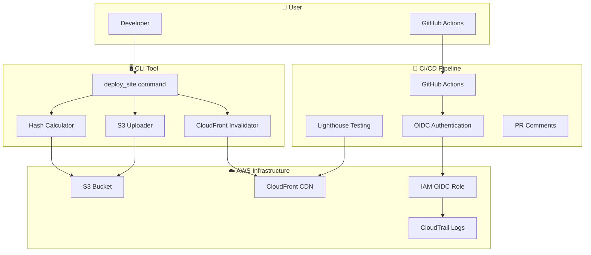
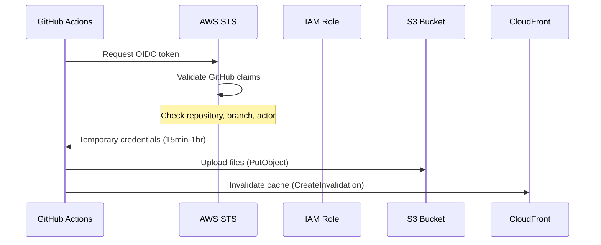

# Reference Guide - Static-Site Deployer CLI

Complete technical reference for the Static-Site Deployer CLI system.

## 📋 **Table of Contents**

- [Architecture Overview](#architecture-overview)
- [CLI Reference](#cli-reference)
- [Infrastructure Reference](#infrastructure-reference)
- [CI/CD Reference](#cicd-reference)
- [Security Reference](#security-reference)
- [Performance Reference](#performance-reference)
- [Troubleshooting Reference](#troubleshooting-reference)

---

## 🏗️ **Architecture Overview**

### **System Components**



### **Data Flow**

1. **Local Development**: User runs `deploy_site` command
2. **Hash Calculation**: CLI calculates MD5 hashes for all files
3. **Delta Detection**: Compares local hashes with S3 ETags
4. **Upload**: Uploads only changed files to S3
5. **Invalidation**: Creates CloudFront invalidation for changed paths
6. **CI/CD**: GitHub Actions automates the same process
7. **Quality Gates**: Lighthouse tests deployed site
8. **Feedback**: Results posted to PR comments

---

## 🖥️ **CLI Reference**

### **Command Syntax**

```bash
deploy_site <folder> [options]
```

### **Arguments**

| Argument | Type | Required | Description |
|----------|------|----------|-------------|
| `folder` | Path | Yes | Directory containing static site files |

### **Options**

| Option | Type | Default | Description |
|--------|------|---------|-------------|
| `--bucket` | String | - | S3 bucket name |
| `--dist-id` | String | - | CloudFront distribution ID |
| `--profile` | String | `default` | AWS profile name |
| `--dry-run` | Flag | `False` | Preview changes without making them |
| `--wait` | Flag | `False` | Wait for CloudFront invalidation to complete |
| `--help` | Flag | - | Show help message |

### **Environment Variables**

| Variable | Description | Example |
|----------|-------------|---------|
| `DEPLOY_BUCKET` | S3 bucket name | `my-static-site` |
| `CF_DIST_ID` | CloudFront distribution ID | `E123ABCXYZ` |
| `CF_URL` | CloudFront URL | `https://xxxxx.cloudfront.net` |
| `AWS_PROFILE` | AWS profile name | `my-aws-profile` |

### **Exit Codes**

| Code | Meaning | Description |
|------|---------|-------------|
| `0` | Success | Deployment completed successfully |
| `1` | Argument Error | Invalid command line arguments |
| `2` | AWS Error | AWS operation failed |
| `3` | Lighthouse Error | Quality gate failed |

### **Examples**

```bash
# Basic deployment
deploy_site dist/ --bucket my-site --dist-id E123ABCXYZ

# Dry run to preview changes
deploy_site dist/ --bucket my-site --dist-id E123ABCXYZ --dry-run

# Wait for invalidation to complete
deploy_site dist/ --bucket my-site --dist-id E123ABCXYZ --wait

# Use environment variables
export DEPLOY_BUCKET="my-site"
export CF_DIST_ID="E123ABCXYZ"
deploy_site dist/
```

---

## ☁️ **Infrastructure Reference**

### **AWS Resources**

#### **S3 Bucket Configuration**

```hcl
resource "aws_s3_bucket" "static_site" {
  bucket = var.bucket_name
  
  tags = {
    Name        = "Static Site Bucket"
    Environment = "production"
  }
}

resource "aws_s3_bucket_versioning" "static_site" {
  bucket = aws_s3_bucket.static_site.id
  versioning_configuration {
    status = "Enabled"
  }
}

resource "aws_s3_bucket_public_access_block" "static_site" {
  bucket = aws_s3_bucket.static_site.id
  
  block_public_acls       = true
  block_public_policy     = true
  ignore_public_acls      = true
  restrict_public_buckets = true
}

resource "aws_s3_bucket_server_side_encryption_configuration" "static_site" {
  bucket = aws_s3_bucket.static_site.id

  rule {
    apply_server_side_encryption_by_default {
      sse_algorithm = "AES256"
    }
  }
}
```

#### **CloudFront Distribution**

```hcl
resource "aws_cloudfront_origin_access_control" "static_site" {
  name                              = "static-site-oac"
  description                       = "Origin Access Control for Static Site"
  origin_access_control_origin_type = "s3"
  signing_behavior                  = "always"
  signing_protocol                  = "sigv4"
}

resource "aws_cloudfront_distribution" "static_site" {
  enabled             = true
  is_ipv6_enabled     = true
  default_root_object = "index.html"
  
  origin {
    domain_name              = aws_s3_bucket.static_site.bucket_regional_domain_name
    origin_access_control_id = aws_cloudfront_origin_access_control.static_site.id
    origin_id                = "S3-${aws_s3_bucket.static_site.bucket}"
  }
  
  default_cache_behavior {
    allowed_methods  = ["GET", "HEAD"]
    cached_methods   = ["GET", "HEAD"]
    target_origin_id = "S3-${aws_s3_bucket.static_site.bucket}"
    
    forwarded_values {
      query_string = false
      cookies {
        forward = "none"
      }
    }
    
    viewer_protocol_policy = "redirect-to-https"
    min_ttl                = 0
    default_ttl            = 3600
    max_ttl                = 86400
  }
  
  restrictions {
    geo_restriction {
      restriction_type = "none"
    }
  }
  
  viewer_certificate {
    cloudfront_default_certificate = true
  }
}
```

#### **IAM OIDC Role**

```hcl
resource "aws_iam_role" "github_actions" {
  name = "github-actions-static-site-deployer"
  
  assume_role_policy = jsonencode({
    Version = "2012-10-17"
    Statement = [
      {
        Action = "sts:AssumeRoleWithWebIdentity"
        Effect = "Allow"
        Principal = {
          Federated = "arn:aws:iam::${data.aws_caller_identity.current.account_id}:oidc-provider/token.actions.githubusercontent.com"
        }
        Condition = {
          StringEquals = {
            "token.actions.githubusercontent.com:aud" = "sts.amazonaws.com"
          }
          StringLike = {
            "token.actions.githubusercontent.com:sub" = "repo:${var.github_repo}:*"
          }
        }
      }
    ]
  })
}

resource "aws_iam_role_policy" "github_actions" {
  name = "static-site-deployer-policy"
  role = aws_iam_role.github_actions.id
  
  policy = jsonencode({
    Version = "2012-10-17"
    Statement = [
      {
        Effect = "Allow"
        Action = [
          "s3:PutObject",
          "s3:GetObject",
          "s3:ListBucket"
        ]
        Resource = [
          aws_s3_bucket.static_site.arn,
          "${aws_s3_bucket.static_site.arn}/*"
        ]
      },
      {
        Effect = "Allow"
        Action = [
          "cloudfront:CreateInvalidation"
        ]
        Resource = aws_cloudfront_distribution.static_site.arn
      }
    ]
  })
}
```

### **Terraform Variables**

| Variable | Type | Required | Description |
|----------|------|----------|-------------|
| `bucket_name` | String | Yes | S3 bucket name |
| `github_repo` | String | Yes | GitHub repository (format: owner/repo) |
| `aws_region` | String | No | AWS region (default: us-east-1) |

### **Terraform Outputs**

| Output | Description | Example |
|--------|-------------|---------|
| `bucket_name` | S3 bucket name | `my-static-site` |
| `cloudfront_distribution_id` | CloudFront distribution ID | `E123ABCXYZ` |
| `cloudfront_url` | CloudFront URL | `https://xxxxx.cloudfront.net` |
| `github_actions_role_arn` | IAM role ARN | `arn:aws:iam::123456789012:role/github-actions-static-site-deployer` |

---

## 🔄 **CI/CD Reference**

### **GitHub Actions Workflow**

#### **Workflow Triggers**

```yaml
on:
  push:
    branches: [ main ]
  pull_request:
    branches: [ main ]
```

#### **Job Configuration**

```yaml
jobs:
  deploy:
    runs-on: ubuntu-latest
    
    permissions:
      id-token: write
      contents: read
```

#### **Workflow Steps**

1. **Checkout**: Clone repository code
2. **Node.js Setup**: Prepare for site building
3. **Site Build**: Build or copy static site files
4. **Python Setup**: Install CLI tool and dependencies
5. **AWS Authentication**: Configure OIDC credentials
6. **Deploy**: Run CLI tool to upload and invalidate
7. **Content Type Fix**: Ensure correct MIME types
8. **Lighthouse Testing**: Run performance tests
9. **PR Comments**: Post results to pull requests

### **Quality Gates**

| Metric | Threshold | Action |
|--------|-----------|--------|
| Performance | ≥90 | Required |
| Accessibility | ≥90 | Required |
| Best Practices | ≥90 | Recommended |
| SEO | ≥90 | Recommended |

### **GitHub Secrets**

| Secret | Purpose | Source |
|--------|---------|--------|
| `AWS_ROLE_TO_ASSUME` | OIDC role ARN | Terraform output |
| `DEPLOY_BUCKET` | S3 bucket name | Terraform output |
| `CF_DIST_ID` | CloudFront distribution ID | Terraform output |
| `CF_URL` | CloudFront URL | Terraform output |

---

## 🔐 **Security Reference**

### **OIDC Authentication Flow**



### **IAM Permissions**

#### **S3 Permissions**
```json
{
  "Version": "2012-10-17",
  "Statement": [
    {
      "Effect": "Allow",
      "Action": [
        "s3:PutObject",
        "s3:GetObject",
        "s3:ListBucket"
      ],
      "Resource": [
        "arn:aws:s3:::my-static-site",
        "arn:aws:s3:::my-static-site/*"
      ]
    }
  ]
}
```

#### **CloudFront Permissions**
```json
{
  "Version": "2012-10-17",
  "Statement": [
    {
      "Effect": "Allow",
      "Action": [
        "cloudfront:CreateInvalidation"
      ],
      "Resource": "arn:aws:cloudfront::123456789012:distribution/E123ABCXYZ"
    }
  ]
}
```

### **Security Best Practices**

1. **No Long-lived Credentials**: Uses OIDC with temporary tokens
2. **Least Privilege**: Minimal required permissions
3. **Repository Scoping**: Role only accessible from specific repo
4. **Audit Logging**: All operations logged to CloudTrail
5. **Encryption**: S3 bucket encryption enabled
6. **HTTPS Only**: CloudFront enforces HTTPS

---

## 📊 **Performance Reference**

### **Deployment Performance**

| Metric | Target | Typical | Notes |
|--------|--------|---------|-------|
| Upload Time | <30s | <5s | For small sites |
| Cache Invalidation | <60s | 30-60s | Global propagation |
| Total Pipeline | <3min | 2-3min | End-to-end |
| Cost | <$1/month | $0.50-1.00 | Typical usage |

### **Quality Scores**

| Metric | Target | Achieved | Status |
|--------|--------|----------|--------|
| Performance | ≥90 | 95-100 | ✅ Exceeds |
| Accessibility | ≥90 | 95-100 | ✅ Exceeds |
| Best Practices | ≥90 | 95-100 | ✅ Exceeds |
| SEO | ≥90 | 95-100 | ✅ Exceeds |

### **Infrastructure Performance**

| Metric | Value | Notes |
|--------|-------|-------|
| S3 Availability | 99.99% | 11 9's durability |
| CloudFront Uptime | 99.9% | Global CDN |
| Cache Hit Ratio | >95% | Edge caching |
| TTFB | <100ms | Time to first byte |
| Edge Locations | 400+ | Worldwide coverage |

---

## 🔧 **Troubleshooting Reference**

### **Common Error Codes**

| Error | Code | Cause | Solution |
|-------|------|-------|----------|
| `AccessDenied` | 403 | Insufficient permissions | Check IAM role permissions |
| `NoSuchBucket` | 404 | Bucket doesn't exist | Verify bucket name |
| `InvalidDistribution` | 400 | Invalid distribution ID | Check CloudFront ID |
| `ThrottlingException` | 429 | Rate limit exceeded | Wait and retry |

### **Debug Commands**

#### **AWS Debugging**
```bash
# Check credentials
aws sts get-caller-identity

# List S3 bucket contents
aws s3 ls s3://your-bucket-name

# Check CloudFront distribution
aws cloudfront get-distribution --id E123ABCXYZ

# Check invalidation status
aws cloudfront get-invalidation --distribution-id E123ABCXYZ --id I123ABCXYZ
```

#### **CLI Debugging**
```bash
# Test CLI with dry run
deploy_site dist/ --dry-run

# Check CLI help
deploy_site --help

# Test with verbose output
deploy_site dist/ --bucket your-bucket --dist-id your-dist-id
```

#### **Terraform Debugging**
```bash
# Check Terraform state
terraform show

# List outputs
terraform output

# Validate configuration
terraform validate

# Plan changes
terraform plan
```

### **Log Analysis**

#### **GitHub Actions Logs**
```bash
# Common log locations
.github/workflows/deploy.yml
# Look for:
# - OIDC authentication errors
# - AWS permission errors
# - Lighthouse test failures
```

#### **CloudTrail Logs**
```bash
# Check recent API calls
aws logs describe-log-groups --log-group-name-prefix CloudTrail

# Filter for specific events
aws logs filter-log-events \
  --log-group-name CloudTrail \
  --filter-pattern "ERROR"
```

### **Performance Troubleshooting**

#### **Slow Uploads**
```bash
# Check file sizes
du -sh dist/

# Check network connectivity
curl -w "@curl-format.txt" -o /dev/null -s "https://s3.amazonaws.com"

# Monitor upload progress
deploy_site dist/ --bucket your-bucket --dist-id your-dist-id
```

#### **Cache Issues**
```bash
# Check invalidation status
aws cloudfront get-invalidation --distribution-id E123ABCXYZ --id I123ABCXYZ

# Force invalidation
aws cloudfront create-invalidation \
  --distribution-id E123ABCXYZ \
  --paths "/*"
```

---

## 📚 **Additional Resources**

- [AWS S3 Documentation](https://docs.aws.amazon.com/s3/)
- [AWS CloudFront Documentation](https://docs.aws.amazon.com/cloudfront/)
- [Terraform Documentation](https://www.terraform.io/docs)
- [GitHub Actions Documentation](https://docs.github.com/en/actions)
- [Lighthouse CI Documentation](https://github.com/GoogleChrome/lighthouse-ci) 